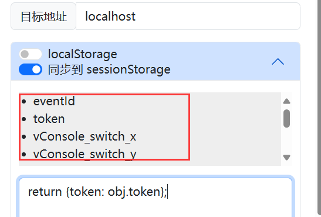

# copyTabStorage

## 特性
 - 一键复制当前页面的localStorage，sessionStorage到其他tab页
 - 支持复制某一项localStorage到剪切板，不用打开控制台查看
 - 支持定义函数对localStorage，sessionStorage进行更改后复制
 - 支持将localStorage复制到sessionStorage，反之亦可

## 使用
将localstroage复制到目标窗口，并且可配置(默认复制所有)

- 目标地址：域名+（端口），域名相同时可用端口区分不同窗口，否则会复制到所有域名下的tab页
- localStorage开关，是否复制localStorage。展开可对localStorage进行更改后复制，比如：
- 同步开关，可以将localStorage复制到目标窗口的sessionStorage，反之亦可
- cookie开关，是否复制cookie

```js
// 下面的代码会将使用函数对localStorage进行更改后复制到目标窗口
return {
	...obj,
    token: obj['token'].split(',')[0]
};

```
obj为当前页面的localStorage键值构成的对象，返回的结果也将以键值对的形式复制到目标窗口的localStorage中


## 复制单个localStorage



点击即可复制某一项localStorage到剪切板

## 复制代码按钮

用于复制setItem代码，在控制台中执行即可完成复制,用于无法一键复制的情况
你可以得到如下代码：

```js
/** 请在目标页面的控制台中执行--复制token **/;
sessionStorage.setItem('token', 'XXXXX');
```

由于浏览器限制，无法读取剪切板内容，所以需要手动在控制台中执行（正在想办法）

或许执行代码的时候，浏览器会有警告，按照提示允许即可

